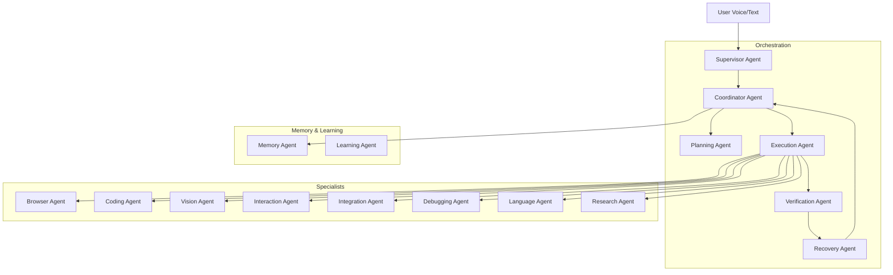

# JARVIS Voice Assistant — Complete Technical Reference

> **Generated from codebase analysis on 2026-08-11. All facts are verified from actual source code.**

---

## Executive Summary

JARVIS is a **real-time, voice-enabled AI assistant** built on a **multi-agent orchestration architecture**. It combines:

- **LiveKit WebRTC** for real-time voice I/O (speech-to-text + text-to-speech)
- **FastAPI** for REST API and WebSocket endpoints
- **A 16-agent swarm** coordinated through an in-memory async event bus
- **A two-speed learning loop** (fast EMA scoring + nightly consolidation)
- **OS-level automation capabilities** (desktop control, browser automation, file system, process management)
- **Multi-provider LLM fallback** (Gemini → Groq → OpenAI → DeepSeek → OpenRouter)

The system is designed to receive voice or text commands, decompose them into executable plans (DAGs), dispatch steps to specialist agents, verify results, recover from failures, and learn from every execution.

**Primary Users:** Developers or power users seeking a personal AI assistant capable of autonomous multi-step task execution on their local machine.

**Maturity:** Actively developed. Core orchestration and voice pipeline are functional. The Redis-backed durable message bus is a documented stub. Several integration-agent task types remain stubbed. A comprehensive future plan (`plan.md`) describes the next evolution phases.

---

## Table of Contents

- [1. Project Identification](#1-project-identification)
- [2. Complete Project Structure](#2-complete-project-structure)
- [3. Architecture](#3-architecture)
- [4. Technology Stack](#4-technology-stack)
- [5. Entry Points](#5-entry-points)
- [6. Core Modules](#6-core-modules)
- [7. The Agent System](#7-the-agent-system)
- [8. Data Flow](#8-data-flow)
- [9. Database & Data Storage](#9-database--data-storage)
- [10. API & Communication Layer](#10-api--communication-layer)
- [11. Authentication & Authorization](#11-authentication--authorization)
- [12. Security Analysis](#12-security-analysis)
- [13. Frontend / UI](#13-frontend--ui)
- [14. Backend / Server](#14-backend--server)
- [15. External Services & Integrations](#15-external-services--integrations)
- [16. The Two-Speed Learning Loop](#16-the-two-speed-learning-loop)
- [17. Background Tasks](#17-background-tasks)
- [18. State Management & Caching](#18-state-management--caching)
- [19. Error Handling](#19-error-handling)
- [20. Logging & Monitoring](#20-logging--monitoring)
- [21. Testing](#21-testing)
- [22. Build System & Deployment](#22-build-system--deployment)
- [23. Configuration & Environment Variables](#23-configuration--environment-variables)
- [24. Dependencies](#24-dependencies)
- [25. Local Development](#25-local-development)
- [26. Important Business Flows](#26-important-business-flows)
- [27. Performance Analysis](#27-performance-analysis)
- [28. Scalability](#28-scalability)
- [29. Code Quality](#29-code-quality)
- [30. Legacy / Unused / Suspicious Files](#30-legacy--unused--suspicious-files)
- [31. Known Issues](#31-known-issues)
- [32. Limitations](#32-limitations)
- [33. Architectural Decisions](#33-architectural-decisions)
- [34. Future Roadmap](#34-future-roadmap)
- [35. Important File Index](#35-important-file-index)
- [36. Glossary](#36-glossary)
- [37. Final System Summary](#37-final-system-summary)

---

## 1. Project Identification

| Attribute | Value |
|---|---|
| **Project Name** | JARVIS Voice Assistant |
| **Project Type** | Real-time voice-enabled AI assistant / Multi-agent orchestration platform |
| **Primary Purpose** | Autonomous task execution via voice or text commands on a local machine |
| **Main Problem Solved** | Bridging natural language intent to multi-step automated execution (file ops, browser, desktop, code, APIs) |
| **Intended Users** | Developers and power users on Windows |
| **Primary Language** | Python 3.12+ |
| **Primary Frameworks** | FastAPI, LiveKit Agents SDK, Google GenAI |
| **Architecture** | Multi-agent swarm with event bus + DAG-based plan execution |
| **Deployment Model** | Local-first (runs on user's machine); Docker option available |
| **External Services** | Google Gemini API, Groq API, OpenAI API, DeepSeek API, OpenRouter API, LiveKit Cloud |

---

## 2. Complete Project Structure

```
d:\Jarvis\
├── apps/
│   ├── backend/                          # Python backend (FastAPI + LiveKit Agent)
│   │   ├── main.py                       # Application entry point
│   │   ├── agent.py                      # LiveKit RTC agent worker
│   │   ├── container.py                  # Dependency injection container
│   │   ├── ai/
│   │   │   ├── agents/                   # 16 specialist agents
│   │   │   │   ├── base_agent.py         # Abstract base agent with multi-LLM fallback
│   │   │   │   ├── types.py              # AgentTask, AgentResult, AgentTaskTypes contracts
│   │   │   │   ├── shared_context.py     # Thread-safe blackboard for agent collaboration
│   │   │   │   ├── supervisor/           # Top-level orchestrator, voice interface
│   │   │   │   ├── coordinator/          # Strategic routing and goal execution
│   │   │   │   ├── planning/             # DAG plan generation
│   │   │   │   ├── execution/            # Plan step execution and tool routing
│   │   │   │   ├── verification/         # Result quality gate
│   │   │   │   ├── recovery/             # Failure recovery strategies
│   │   │   │   ├── memory/               # Memory storage and retrieval
│   │   │   │   ├── browser/              # Browser automation (Playwright)
│   │   │   │   ├── coding/               # Code writing, refactoring, AST analysis
│   │   │   │   ├── debugging/            # Error diagnosis and self-healing
│   │   │   │   ├── integration/          # External API/webhook interactions
│   │   │   │   ├── interaction/          # Grounded perception-action UI loops
│   │   │   │   ├── vision/               # Screen analysis, element location, OCR
│   │   │   │   ├── language/             # Translation, language detection, NLP
│   │   │   │   ├── research/             # Web research and fact-checking
│   │   │   │   ├── learning/             # Self-improvement via training curricula
│   │   │   │   └── voice/                # Voice stream processing utility
│   │   │   ├── rag_orchestrator.py       # Retrieval-Augmented Generation orchestrator
│   │   │   └── workflow_dag.py           # DAG definition, validation, topological sort
│   │   ├── api/
│   │   │   ├── app.py                    # FastAPI application factory
│   │   │   ├── dependencies.py           # DI helpers for route handlers
│   │   │   ├── middleware/
│   │   │   │   ├── auth.py               # API key / JWT authentication
│   │   │   │   └── rate_limit.py         # Token bucket rate limiter
│   │   │   └── routes/
│   │   │       ├── agents.py             # Agent listing and dispatch endpoints
│   │   │       ├── approvals.py          # Security approval gate endpoints
│   │   │       ├── files.py              # File operations endpoints
│   │   │       ├── health.py             # Health check endpoint
│   │   │       ├── observability.py      # Traces and stats endpoints
│   │   │       ├── tasks.py              # Task CRUD and lifecycle endpoints
│   │   │       ├── websocket.py          # Real-time WebSocket event stream
│   │   │       ├── workflows.py          # Workflow CRUD and execution
│   │   │       ├── schedules.py          # Cron-based scheduled workflows
│   │   │       ├── skills.py             # Skill registry endpoints
│   │   │       └── auth.py               # User signup/login endpoints
│   │   ├── config/
│   │   │   └── settings.py              # Centralized configuration, LLM model maps
│   │   ├── domain/
│   │   │   └── models.py                # Data models (User, Task, Workflow, AuditLog, etc.)
│   │   ├── events/
│   │   │   └── bus.py                   # AgentBus — in-memory async event bus
│   │   ├── integrations/
│   │   │   ├── gemini_llm.py            # Google Gemini API integration
│   │   │   └── livekit_service.py       # LiveKit WebRTC service
│   │   ├── modules/
│   │   │   ├── approval/                # Security approval store (SQLite)
│   │   │   ├── bus/                     # AbstractBus + RedisBus (stub)
│   │   │   ├── controls/               # OS controllers (app, browser, desktop, keyboard, mouse, screen)
│   │   │   ├── execution/              # ExecutionEngine, RecoveryEngine, WorldStateManager
│   │   │   ├── filesystem/             # FileManager, FSIndexer, FolderManager
│   │   │   ├── knowledge/              # Knowledge graph (entity-relationship extraction)
│   │   │   ├── language/               # Translation, language detection, Indic OCR
│   │   │   ├── learning/               # Learning orchestrator, experience replay, curriculum
│   │   │   ├── memory/                 # MemoryManager (Phase 5 Cognitive Architecture)
│   │   │   ├── notification/           # Notification service
│   │   │   ├── observability/          # TraceStore, TraceSpan, cost estimator
│   │   │   ├── planning/              # TaskPlanner, DAGCompiler, TaskScheduler
│   │   │   ├── security/              # SecurityManager (tier enforcement, JWT, blocked commands)
│   │   │   ├── shared/                # Utilities (sanitize_path, OpenRouter text helper, read/write lock)
│   │   │   ├── skills/               # Skill registry and base skill class
│   │   │   ├── task/                  # AgentStateManager, PriorityTaskScheduler, MasterOrchestrator
│   │   │   └── vision/               # VisionManager, ScreenObserver, UIMapper
│   │   ├── server/
│   │   │   ├── app.py                # JarvisApplication (unified server)
│   │   │   └── lifespan.py           # FastAPI startup/shutdown lifecycle
│   │   ├── tools/
│   │   │   └── builtin/
│   │   │       ├── base.py           # JarvisToolset base (LiveKit-compatible)
│   │   │       ├── browser/          # Browser automation tools
│   │   │       ├── coding/           # Code analysis and writing tools
│   │   │       ├── filesystem/       # File I/O tools
│   │   │       ├── media/            # Audio/media tools
│   │   │       ├── system/           # System command and process tools
│   │   │       ├── vision/           # Screen capture and analysis tools
│   │   │       └── web/              # URL fetching and web search tools
│   │   └── tests/
│   │       ├── agents/               # Agent routing, bus concurrency, all-agent tests
│   │       ├── unit/                 # Database, memory, success learner, bus stress tests
│   │       ├── integration/          # API auth flow, end-to-end AI OS test
│   │       └── module_tests/         # Learning agent extreme tests
│   └── frontend/
│       └── dist/                     # Pre-built static web application
│           ├── index.html            # SPA with tabbed control center
│           ├── css/                  # Modular CSS (theme, layout, voice, tasks, agents, modals)
│           └── js/                   # Modular JS (app, api, voice, tasks, dag, websocket, inspector, utils, settings)
├── docs/
│   ├── architecture.md               # High-level architecture document
│   └── realtime_learning_architecture.md  # Detailed learning system design (35KB)
├── examples/
│   └── agent_exercise_guide.md       # Guided developer exercise scenarios
├── infra/
│   ├── Dockerfile.backend            # Python 3.12 Docker image
│   ├── docker-compose.yml            # Production compose
│   └── docker-compose.dev.yml        # Development compose with volume mounts
├── scripts/
│   ├── smoke_test.py                 # Agent boot verification (all 14+ agents)
│   ├── e2e_smoke.py                  # End-to-end swarm execution test (5 scenarios)
│   ├── seed_and_verify_learning.py   # Database seeding utility
│   ├── check_learning_status.py      # CLI monitoring dashboard
│   ├── train_loop.py                 # Automated training loop
│   ├── run_goal.py                   # CLI goal dispatcher
│   ├── run_goal_patched.py           # Extended goal dispatcher
│   ├── trigger_nightly.py            # Manual nightly job trigger
│   ├── view_traces.py               # Trace viewer CLI
│   ├── backfill_indexer.py           # ChromaDB backfill from SQLite
│   ├── announcer_smoke_test.py       # Announcer module test
│   └── session_memory_smoke_test.py  # Session memory test
├── start_jarvis.bat                  # Windows launcher script
├── plan.md                           # Future evolution plan (Phase 0–5)
├── README.md                         # Project README
├── .gitignore                        # Git ignore rules
├── .env                              # Environment variables (gitignored)
└── venv/                             # Python virtual environment
```

---

## 3. Architecture

JARVIS uses a **multi-agent swarm architecture** with the following layers:

```
┌─────────────────────────────────────────────────────────────────────────────┐
│                          PRESENTATION LAYER                                  │
│  ┌──────────────────┐  ┌──────────────────────────────────────────────────┐ │
│  │  LiveKit WebRTC   │  │  Static Web UI (Vanilla HTML/CSS/JS)            │ │
│  │  (Voice I/O)      │  │  - Voice Console (Siri-style wave visualizer)   │ │
│  │  - STT / TTS      │  │  - Task Pipeline (Kanban board)                │ │
│  │  - VAD            │  │  - Agent Directory                             │ │
│  └────────┬─────────┘  │  - Workflow DAG Viewer                         │ │
│           │             │  - Approvals Gate                              │ │
│           │             │  - Observability Dashboard                     │ │
│           │             └──────────────────────┬─────────────────────────┘ │
│           │                                    │                           │
│           ▼                                    ▼                           │
│  ┌─────────────────────────────────────────────────────────────────────┐   │
│  │                        API LAYER (FastAPI)                          │   │
│  │  REST endpoints + WebSocket + Rate Limiting + Auth Middleware       │   │
│  └────────────────────────────────┬────────────────────────────────────┘   │
└───────────────────────────────────┼────────────────────────────────────────┘
                                    │
┌───────────────────────────────────┼────────────────────────────────────────┐
│                       ORCHESTRATION LAYER                                   │
│                                   ▼                                         │
│  ┌─────────────────────────────────────────────────────────────────────┐   │
│  │               AgentBus (In-Memory Async Event Bus)                  │   │
│  │  - Register handlers per agent_id                                   │   │
│  │  - Dispatch tasks with timeout + tracing                            │   │
│  │  - Fast learning loop (EMA score update after every task)           │   │
│  │  - Cycle detection via dispatch_chain                               │   │
│  └───┬───────────┬───────────┬───────────┬───────────┬─────────────────┘   │
│      │           │           │           │           │                      │
│      ▼           ▼           ▼           ▼           ▼                      │
│  Supervisor → Coordinator → Planning → Execution → Specialists             │
│                                          │          (Browser, Coding,       │
│                                          │           Vision, Language,      │
│                                          ▼           Research, Integration, │
│                                    Verification      Interaction, etc.)     │
│                                          │                                  │
│                                          ▼                                  │
│                                      Recovery                               │
│                                          │                                  │
│                                          ▼                                  │
│                                       Memory                                │
└─────────────────────────────────────────────────────────────────────────────┘
                                    │
┌───────────────────────────────────┼────────────────────────────────────────┐
│                         DATA LAYER                                          │
│  ┌──────────────────┐  ┌──────────────────┐  ┌─────────────────────────┐  │
│  │ SQLite Databases  │  │ ChromaDB Vector  │  │ In-Memory Stores        │  │
│  │ - memory.db       │  │   Store           │  │ - Plans (PlanEngine)    │  │
│  │ - traces.db       │  │ - conversations   │  │ - Skills (Registry)     │  │
│  │ - approvals.db    │  │ - workflows       │  │ - Transcripts           │  │
│  │ - tasks.db        │  │ - memories        │  │ - SharedContext         │  │
│  │ - file_manager.db │  │                   │  │ - Agent State           │  │
│  └──────────────────┘  └──────────────────┘  └─────────────────────────┘  │
└─────────────────────────────────────────────────────────────────────────────┘
                                    │
┌───────────────────────────────────┼────────────────────────────────────────┐
│                      OS INTERACTION LAYER                                    │
│  ┌────────┐ ┌──────────┐ ┌──────────┐ ┌──────────┐ ┌───────────────────┐  │
│  │Desktop │ │ Browser  │ │Keyboard  │ │  Mouse   │ │Process Controller │  │
│  │Control │ │Controller│ │Controller│ │Controller│ │(psutil/subprocess)│  │
│  └────────┘ └──────────┘ └──────────┘ └──────────┘ └───────────────────┘  │
│  Libraries: pyautogui, pygetwindow, playwright, psutil, pyperclip          │
└─────────────────────────────────────────────────────────────────────────────┘
```

### Architecture Style
- **Primary:** Multi-agent swarm with centralized event bus
- **Planning:** DAG-based task decomposition (Directed Acyclic Graph)
- **Execution:** Pipeline pattern (Plan → Execute → Verify → Recover)
- **Memory:** Two-speed learning loop (fast EMA + slow nightly consolidation)
- **Communication:** In-process async message bus (no durable queue yet)
- **DI Pattern:** Manual singleton container (`ServiceContainer`)

---

## 4. Technology Stack

| Category | Technology | Purpose | Evidence/Location |
|---|---|---|---|
| **Language** | Python 3.12+ | Core application language | `Dockerfile.backend`, `venv/` |
| **Web Framework** | FastAPI | REST API, WebSocket, middleware | `api/app.py` |
| **Real-Time** | LiveKit Agents SDK | WebRTC voice I/O, STT, TTS, VAD | `agent.py`, `main.py` |
| **LLM (Primary)** | Google Gemini (2.5-flash, 2.0-flash) | Agent intelligence | `base_agent.py`, `config/settings.py` |
| **LLM (Fallback 1)** | Groq (Llama 3.3 70B) | Fast inference fallback | `base_agent.py` |
| **LLM (Fallback 2)** | OpenAI (GPT-4o-mini) | Fallback provider | `base_agent.py` |
| **LLM (Fallback 3)** | DeepSeek (deepseek-chat) | Fallback provider | `base_agent.py` |
| **LLM (Fallback 4)** | OpenRouter (Qwen, DeepSeek R1) | Free-tier fallback | `base_agent.py`, `config/settings.py` |
| **Database** | SQLite (via `aiosqlite`) | Persistent structured storage | `modules/memory/`, `modules/database/` |
| **Vector Store** | ChromaDB | Semantic similarity search on episodic memory | `modules/memory/manager.py` |
| **Browser Automation** | Playwright | Headless browser control | `modules/controls/browser_controller.py` |
| **Desktop Automation** | PyAutoGUI, PyGetWindow | Mouse, keyboard, window management | `modules/controls/` |
| **Process Management** | psutil | System monitoring and process control | `modules/execution/world_state.py` |
| **ASGI Server** | Uvicorn | Serves FastAPI application | `main.py` |
| **Frontend** | Vanilla HTML/CSS/JS | Static SPA web interface | `apps/frontend/dist/` |
| **Frontend CDN** | LiveKit Client SDK, Marked.js, DOMPurify, Highlight.js | WebRTC, markdown rendering, sanitization | `index.html` |
| **Containerization** | Docker, Docker Compose | Optional containerized deployment | `infra/` |
| **Testing** | pytest, pytest-asyncio | Unit, integration, stress tests | `tests/` |
| **MCP** | Model Context Protocol (via npx) | External tool server integration | `tools/builtin/`, `agent.py` |
| **OCR** | pytesseract | Indic script text extraction | `modules/language/indic_ocr_service.py` |
| **Fuzzy Matching** | RapidFuzz | File search, app name matching | `modules/controls/`, `modules/filesystem/` |
| **Security** | python-jose | JWT token generation | `modules/security/manager.py` |

---

## 5. Entry Points

### 5.1 Application Startup — `main.py`

| Attribute | Value |
|---|---|
| **File** | `apps/backend/main.py` |
| **Command** | `python main.py` (or via `start_jarvis.bat`) |
| **Purpose** | Single unified entry point for the entire JARVIS system |

**What happens after execution:**
1. Loads `.env` from `d:\Jarvis\.env`
2. Sets up rotating file logging (`logs/` directory)
3. Validates required environment variables (LiveKit credentials)
4. Starts the FastAPI server on a background daemon thread (`uvicorn` on `0.0.0.0:8000`)
5. Starts the LiveKit agent CLI (blocking) — this connects to the LiveKit server and waits for room sessions

### 5.2 LiveKit RTC Agent — `agent.py`

| Attribute | Value |
|---|---|
| **File** | `apps/backend/agent.py` |
| **Command** | Called internally by LiveKit's worker framework |
| **Purpose** | Handles real-time voice sessions |

**What happens after execution:**
1. Connects to a LiveKit room
2. Builds the `ServiceContainer` (all services initialized)
3. Creates `AgentSession` with voice activity detection (VAD)
4. Configures Gemini as the LLM and Google TTS
5. Sets up `SupervisorAgent` as the session handler
6. Configures MCP tool servers (DuckDuckGo search, Brave search, Git)
7. Starts the session — agent listens for user speech

### 5.3 Windows Launcher — `start_jarvis.bat`

| Attribute | Value |
|---|---|
| **File** | `start_jarvis.bat` |
| **Command** | Double-click or `start_jarvis.bat` |
| **Purpose** | Activates venv and launches `main.py dev` |

### 5.4 Script Entry Points

| Script | Command | Purpose |
|---|---|---|
| `scripts/smoke_test.py` | `python scripts/smoke_test.py` | Verify all agents boot correctly |
| `scripts/e2e_smoke.py` | `python scripts/e2e_smoke.py` | End-to-end swarm test (5 scenarios) |
| `scripts/check_learning_status.py` | `python scripts/check_learning_status.py` | CLI learning dashboard |
| `scripts/seed_and_verify_learning.py` | `python scripts/seed_and_verify_learning.py` | Seed learning database |
| `scripts/train_loop.py` | `python scripts/train_loop.py` | Automated training loop |
| `scripts/trigger_nightly.py` | `python scripts/trigger_nightly.py` | Manual nightly maintenance |
| `scripts/run_goal.py` | `python scripts/run_goal.py "goal text"` | CLI goal dispatch |

---

## 6. Core Modules

### 6.1 Event Bus (`events/bus.py`)

| Attribute | Detail |
|---|---|
| **Module** | `AgentBus` (extends `AbstractBus`) |
| **Purpose** | In-memory async message router — the only communication channel between agents |
| **Mechanism** | Dict of `agent_id → async handler` callbacks |

**Key Methods:**
- `register(agent_id, handler)` — Registers an agent's handler
- `dispatch(task: AgentTask, timeout) → AgentResult` — Routes task to target agent, wraps in TraceSpan, applies agent-specific timeouts, calls `_record_fast_loop` on success
- `dispatch_many(tasks) → List[AgentResult]` — Parallel dispatch via `asyncio.gather`

**Critical Detail:** The bus imports `ServiceContainer` lazily inside `dispatch()` to break circular dependencies. This is a known coupling issue documented in `plan.md`.

**Limitations:** No persistence, no retry/dead-letter, no cancellation, no backpressure.

### 6.2 Service Container (`container.py`)

| Attribute | Detail |
|---|---|
| **Module** | `ServiceContainer` |
| **Purpose** | Manual dependency injection container (singleton) |
| **Pattern** | Lazy factory initialization via `_make_*` functions |

**Construction Order (10 stages):**
1. Configuration (`Settings`)
2. Core Infrastructure (`AgentBus`, `DatabaseManager`)
3. Memory & Learning (`MemoryManager`, `SuccessLearner`)
4. Execution (`WorldStateManager`, `ExecutionEngine`, `RecoveryEngine`, `PlanEngine`)
5. Tools & Skills (`SkillRegistry`, `ToolRouter`)
6. Integrations (`GeminiLLM`, `LiveKitService`)
7. Observability (`TraceStore`)
8. Security & Approval (`SecurityManager`, `ApprovalStore`)
9. Task Management (`PriorityTaskScheduler`, `MasterOrchestrator`)
10. Notification (`NotificationManager`)

### 6.3 Execution Engine (`modules/execution/execution_engine.py`)

| Attribute | Detail |
|---|---|
| **Module** | `ExecutionEngine` |
| **Purpose** | Central tool dispatcher — routes tool calls from plan steps to implementations |
| **Timeout** | 120 seconds per tool execution |
| **Security** | Checks `SecurityManager` tier; `TIER_CONFIRM` tools require approval |

**Registered Tool Categories:**
- **File operations:** `read_file`, `write_file`, `list_directory`, `search_files`, `create_dir`, `delete_file`, `move_file`
- **System:** `run_command`, `get_system_info`, `take_screenshot`, `open_app`, `kill_process`
- **Browser:** `navigate`, `click`, `type`, `get_content`, `browser_screenshot`, `execute_js`
- **Desktop:** `click_at`, `double_click`, `right_click`, `scroll`, `type_text`, `press_key`, `hotkey`
- **Mouse:** `move_to`, `drag_to`, `get_position`

### 6.4 Memory Manager (`modules/memory/manager.py`)

| Attribute | Detail |
|---|---|
| **Module** | `MemoryManager` (Phase 5 Cognitive Memory Architecture) |
| **Purpose** | Unified facade for all memory operations |
| **Storage** | SQLite (structured) + ChromaDB (semantic vectors) |
| **Architecture** | Mixin-based: `MemorySchemaMixin`, `MemoryStoreMixin`, `MemorySearchMixin`, `KnowledgeGraphMixin`, `MemoryVisionMixin`, `MemoryLifecycleMixin` |

**ChromaDB Collections:** `conversations`, `workflows`, `memories`

**Key capabilities:**
- Conversation logging and retrieval
- Workflow execution recording
- Episodic memory storage with vector embeddings
- Semantic similarity search
- Agent task outcome recording
- Tool reliability tracking
- Knowledge graph entity extraction

**Async Writer:** Background task (`_async_writer_loop`) processes a queue of write operations to avoid blocking the event loop.

### 6.5 World State Manager (`modules/execution/world_state.py`)

| Attribute | Detail |
|---|---|
| **Module** | `WorldStateManager` (thread-safe singleton) |
| **Purpose** | OS-level system sensing + shared mutable state |

**OS Sensing (read-only):**
- Running processes (via `psutil`)
- Open windows (via `pygetwindow`)
- Clipboard content (via `pyperclip`)
- CPU/memory/disk usage (via `psutil`)

**Shared State (read/write):**
- Generic `get_shared_state(key)` / `update_shared_state(key, value)` dict
- **Issue:** No schema, no ownership enforcement, any agent can read/write any key

### 6.6 Plan Engine (`modules/planning/plan_engine.py`)

| Attribute | Detail |
|---|---|
| **Module** | `PlanEngine` |
| **Purpose** | Validates, stores, and manages execution plans (DAGs) |
| **Storage** | In-memory dict (plans lost on restart) |

Validates plan structure: each step must have `action`, `target_agent`, `description`. Supports `depends_on` fields for DAG ordering.

### 6.7 Security Manager (`modules/security/manager.py`)

| Attribute | Detail |
|---|---|
| **Module** | `SecurityManager` |
| **Purpose** | Enforces security tiers and path safety |

**Security Tiers:**
| Tier | Examples | Behavior |
|---|---|---|
| `TIER_SAFE` | `read_file`, `list_directory`, `get_system_info`, `take_screenshot` | Auto-approved |
| `TIER_MODERATE` | `write_file`, `create_dir`, `navigate`, `click`, `type` | Auto-approved with logging |
| `TIER_CONFIRM` | `run_command`, `delete_file`, `kill_process`, `open_app`, `execute_js` | Requires explicit user approval |
| `TIER_FORBIDDEN` | Blocked commands (e.g., `rm -rf /`, `format`) | Always rejected |

**Path Safety:** `is_safe_path()` prevents path traversal attacks.
**JWT:** Can generate JWT tokens for API authentication.
**Blocked Commands:** Hardcoded list of dangerous shell commands.

### 6.8 Additional Modules

| Module | Path | Purpose |
|---|---|---|
| **ApprovalStore** | `modules/approval/` | Persists approval requests for `TIER_CONFIRM` operations in SQLite |
| **Controls** | `modules/controls/` | 8 OS controllers (app, browser, desktop, keyboard, mouse, process, screen, system) |
| **FileManager** | `modules/filesystem/` | File ops with metadata tracking, fuzzy search, history, locking |
| **KnowledgeGraph** | `modules/knowledge/` | Entity-relationship extraction from conversations |
| **Language** | `modules/language/` | Translation, language detection, Indic OCR |
| **Learning** | `modules/learning/` | Learning orchestrator, experience replay, skill gap tracking |
| **Notification** | `modules/notification/` | User notification service (voice, UI, log channels) |
| **Observability** | `modules/observability/` | TraceStore, TraceSpan, cost estimator |
| **Planning** | `modules/planning/` | TaskPlanner tools, DAG compiler, task scheduler |
| **Skills** | `modules/skills/` | Skill registry + 25 skill implementations |
| **Task** | `modules/task/` | AgentStateManager, PriorityTaskScheduler, MasterOrchestrator |
| **Vision** | `modules/vision/` | VisionManager, ScreenObserver, UIMapper, rate limiter |

---

## 7. The Agent System

### 7.1 Base Agent (`ai/agents/base_agent.py`)

All agents inherit from `BaseAgent` which provides:

1. **Task handler registration** — `register_handler(task_type, handler)` maps task types to handler methods
2. **Task dispatch entry point** — `handle(task: AgentTask) → AgentResult`:
   - Checks for routing cycles (via `dispatch_chain`)
   - Looks up and calls the registered handler
   - Records outcome asynchronously
3. **Multi-provider LLM fallback** — `generate_response(prompt) → str`:
   ```
   Groq (llama-3.3-70b) → OpenAI (gpt-4o-mini) → DeepSeek → OpenRouter → Gemini (2.5-flash → 2.0-flash) → Gemma
   ```
   Each provider has a circuit breaker (trips after 3 consecutive failures, resets after 60s).
4. **JSON response parsing** — `_parse_json_response()` handles markdown fences, trailing text, malformed JSON
5. **Outcome recording** — Fire-and-forget background task recording to SQLite
6. **Result factory** — `_create_result()` with fast learning loop trigger

### 7.2 Agent Directory



### 7.3 Individual Agent Profiles

#### Supervisor Agent (`supervisor_agent`)
- **Role:** Top-level orchestrator. Interfaces with LiveKit for voice. All user goals enter here.
- **Task Types:** `speak`, `supervisor_routing`, `supervisor_session`
- **Key Logic:** Classifies goals as "simple" (direct LLM answer) or "complex" (dispatches to coordinator). Manages session state, builds dynamic system prompts incorporating memory, tool constraints, and status board. Handles voice interruptions and debounces context updates.
- **Dependencies:** bus, llm, memory, announcer

#### Coordinator Agent (`coordinator_agent`)
- **Role:** Strategic brain. Generates context, creates plans, orchestrates execution, handles failures.
- **Task Types:** `generate_context`, `evaluate_plan`, `route_subtask`, `execute_goal`
- **Key Logic:** `execute_goal` triggers the full chain: context → plan → execute → verify → recover → record. Uses `_classify_subtask_mode()` with string heuristics (prefix/keyword matching) and LLM fallback for task classification.
- **Known Issue:** Heuristic routing does not consult `SuccessLearner` capability scores.
- **Dependencies:** bus, llm, memory, world_state, recovery_engine

#### Planning Agent (`planning_agent`)
- **Role:** Decomposes natural language goals into executable DAGs.
- **Task Types:** `create_plan`, `replan`
- **Key Logic:** Instructs LLM to generate a JSON plan with steps, dependencies, expected outcomes. Validates DAG structure (cycle detection via DFS). Introspects available tools catalog to inform the LLM.
- **Dependencies:** bus, llm, plan_engine

#### Execution Agent (`execution_agent`)
- **Role:** Executes plan steps by routing them to appropriate specialists.
- **Task Types:** `execute_plan`, `get_world_state`
- **Key Logic:** Iterates plan steps respecting DAG dependencies (via `asyncio.Event`). For each step, determines the target agent based on step type, dispatches to specialist, then dispatches to verification. Applies exponential backoff for transient errors.
- **Dependencies:** bus, llm, world_state, execution_engine

#### Verification Agent (`verification_agent`)
- **Role:** Quality gate before task closure.
- **Task Types:** `verify_result`
- **Key Logic:** Takes result + expected outcome, uses LLM to evaluate. Returns verification report with `success`, `confidence`, and `issues`.
- **Limitation:** No formal `success_criteria` contract — relies entirely on LLM judgment.
- **Dependencies:** bus, llm

#### Recovery Agent (`recovery_agent`)
- **Role:** Handles failures autonomously.
- **Task Types:** `recover_failure`
- **Key Logic:** Classifies errors (`timeout`, `tool_failure`, `permission_denied`, `network_error`, `capability_gap`, `external_service_down`, `unknown`) via `RecoveryEngine`. Queries memory for past failure patterns and lessons. Outputs decision: `retry`, `replan`, `debug`, or `escalate`. Has hard caps to prevent infinite recovery loops.
- **Dependencies:** bus, llm, recovery_engine, memory

#### Memory Agent (`memory_agent`)
- **Role:** Manages the learning and memory systems.
- **Task Types:** `retrieve_context`, `retrieve_last_session`, `retrieve_workflow`, `retrieve_unreliable_tools`, `retrieve_agent_stats`, `store`, `consolidate`, `record_execution_report`
- **Dependencies:** bus, llm, memory_manager, success_learner

#### Browser Agent (`browser_agent`)
- **Role:** Automates web browser tasks via Playwright.
- **Task Types:** `automate_web_flow`
- **Key Logic:** Closed-loop step executor: injects JS to extract DOM, prompts LLM to choose action (`navigate`, `click`, `type`), executes via `BrowserController`, retries on selector failures.
- **Dependencies:** bus, llm, skill_registry

#### Coding Agent (`coding_agent`)
- **Role:** Writes, modifies, tests, and scaffolds code.
- **Task Types:** `write_code`, `refactor_code`, `build_project`, `ast_refactor`, `static_type_check`, `generate_unit_tests`
- **Key Logic:** Uses Python's `ast` module for syntax checks and function/class extraction. Can write files directly via `aiofiles`. Scaffolds full project directory structures.
- **Dependencies:** bus, llm

#### Debugging Agent (`debugging_agent`)
- **Role:** Error diagnosis and self-healing.
- **Task Types:** `diagnose_error`, `apply_self_healing`, `verify_fix`
- **Dependencies:** bus, llm

#### Integration Agent (`integration_agent`)
- **Role:** External API and service interactions.
- **Task Types:** `call_api`, `webhook_flow`, `call_graphql`, `authenticate`, `connect_service`, `sync_data`
- **Key Logic:** `call_api` formulates `aiohttp` requests dynamically.
- **Stubs:** `webhook_flow`, `call_graphql`, `authenticate`, `connect_service`, `sync_data` currently return generic mock payloads.
- **Dependencies:** bus, llm

#### Interaction Agent (`interaction_agent`)
- **Role:** Grounded turn-by-turn perception-action loops for UI automation.
- **Task Types:** `run_grounded_task`
- **Key Logic:** Vision-action loop: screenshot → VisionAgent locates elements → LLM decides action (`click`, `scroll`, `type`, `wait`) → ExecutionAgent performs action. Detects stuck state via screen diffing.
- **Dependencies:** bus, llm, world_state

#### Vision Agent (`vision_agent`)
- **Role:** Visual understanding and element location.
- **Task Types:** `analyze_screen`, `find_ui_element`, `read_screen_text`, `locate_ordinal_element`, `count_visible_items`, `diff_screen_state`
- **Key Logic:** Converts LLM-normalized bounding boxes (0–1000 scale) to absolute screen coordinates. Computes screen hashes for change detection.
- **Dependencies:** bus, llm

#### Language Agent (`language_agent`)
- **Role:** NLP utilities.
- **Task Types:** `detect_language`, `translate_text`, `extract_document_data`, `set_language_preference`, `get_language_preference`
- **Dependencies:** bus, llm

#### Research Agent (`research_agent`)
- **Role:** Web research and synthesis.
- **Task Types:** `research_topic`, `summarize_document`, `fact_check`
- **Dependencies:** bus, llm, web tools

#### Learning Agent (`learning_agent`)
- **Role:** Self-improvement through structured training curricula.
- **Task Types:** `health_check`, `train`, `evaluate`, `generate_curriculum`
- **Key Logic:** Uses `LearningCurriculum`, `LearningEvaluator`, `LearningPolicy` modules.
- **Dependencies:** bus, llm, memory, learning modules

### 7.4 Agent Communication Pattern

All inter-agent communication flows through the `AgentBus`:

```
Agent A                    AgentBus                    Agent B
   │                          │                          │
   │  dispatch(AgentTask)     │                          │
   ├─────────────────────────►│                          │
   │                          │  handler(task)           │
   │                          ├─────────────────────────►│
   │                          │                          │ process task
   │                          │          AgentResult     │
   │                          │◄─────────────────────────┤
   │                          │                          │
   │                          │ record trace span        │
   │                          │ update fast loop (EMA)   │
   │                          │                          │
   │      AgentResult         │                          │
   │◄─────────────────────────┤                          │
```

**Cycle Detection:** Each `AgentTask` carries a `dispatch_chain: List[str]` that records every agent it has passed through. If an agent sees itself in the chain, it rejects the task.

---

## 8. Data Flow

### 8.1 Voice Interaction Flow

```
User speaks
    ↓
LiveKit WebRTC (VAD → STT)
    ↓
SupervisorAgent.handle("supervisor_routing")
    ↓
Classification: simple or complex?
    ├── Simple: LLM generates direct response
    │       ↓
    │   LiveKit TTS → User hears response
    │
    └── Complex: dispatch to CoordinatorAgent
            ↓
        CoordinatorAgent.execute_goal()
            ↓
        Query MemoryAgent for relevant context
            ↓
        PlanningAgent.create_plan() → DAG
            ↓
        ExecutionAgent.execute_plan()
            ↓
        For each DAG step:
            ├── Route to specialist agent
            │       ↓
            │   Execute tool via ExecutionEngine
            │       ↓
            │   VerificationAgent.verify_result()
            │       ├── Pass: mark step done
            │       └── Fail: RecoveryAgent.recover()
            │                   ├── retry
            │                   ├── replan
            │                   └── escalate
            ↓
        Aggregate results
            ↓
        MemoryAgent.record_execution_report()
            ↓
        Response → LiveKit TTS → User hears result
```

### 8.2 API Interaction Flow

```
Frontend submits POST /tasks
    ↓
Auth middleware (API key / JWT)
    ↓
Rate limiter (60 req/min per IP)
    ↓
PriorityTaskScheduler.submit(goal)
    ↓
MasterOrchestrator._process_task()
    ↓
AgentBus.dispatch(task → supervisor_agent)
    ↓
[Same orchestration flow as voice]
    ↓
Result returned via HTTP response
    ↓
WebSocket broadcasts status updates in real-time
```

### 8.3 Learning Data Flow

```
Every agent task completion
    ↓
AgentBus._record_fast_loop()
    ↓
SuccessLearner.update_score(report)
    ├── EMA score update: new = 0.3 * latest + 0.7 * previous
    ├── Failure streak: increment on failure, reset on success
    └── Persist to capability_scores table (SQLite)
    ↓
SuccessLearner.record_lesson(report)
    ├── Notable events (high-confidence failure, outstanding success)
    └── LLM generates lesson → persist to lessons table
    ↓
[Nightly at 03:05]
MemoryLifecycle.run_nightly()
    ├── Recalculate ground-truth success metrics
    ├── Decay old scores (× 0.95 for scores > 7 days)
    ├── Merge similar lessons (LLM consolidation)
    └── Remove orphaned episodic memories
```

---

## 9. Database & Data Storage

### 9.1 SQLite Databases

All SQLite databases use **WAL (Write-Ahead Logging)** journal mode for concurrency. Created at runtime in the configured `DATABASE_DIR` (default: `apps/backend/database/`, gitignored).

#### `memory.db`

| Table | Purpose | Key Columns |
|---|---|---|
| `capability_scores` | EMA learning scores per agent×task_type | `agent_id`, `task_type`, `ema_score`, `sample_count`, `failure_streak`, `last_updated` |
| `lessons` | Learned patterns and recommendations | `lesson_id`, `agent_id`, `task_type`, `pattern`, `recommendation`, `source` (fast/slow), `merged_from` |
| `episodic_memory` | Episodic memory entries | `memory_id`, `agent_id`, `context`, `action`, `outcome`, `score`, `timestamp`, `session_id` |
| `conversations` | Session transcripts | `session_id`, `role`, `content`, `timestamp` |
| `workflows` | Workflow execution records | `name`, `steps_json`, `result_json`, `created_at` |
| `agent_task_outcomes` | Detailed task execution metrics | `task_id`, `agent_id`, `task_type`, `success`, `confidence`, `tokens_used`, `cost_usd`, `duration_ms`, `error` |
| `tool_outcomes` | Tool execution metrics | `tool_name`, `success`, `error`, `duration_ms`, `agent_id`, `timestamp` |
| `entities` | Knowledge graph entities | `entity_id`, `name`, `type`, `metadata` |
| `relationships` | Knowledge graph relationships | `entity1`, `relation`, `entity2` |

#### `traces.db`

| Table | Purpose | Key Columns |
|---|---|---|
| `traces` | Execution trace records | `trace_id`, `agent_id`, `task_type`, `success`, `confidence`, `duration_ms`, `error`, `timestamp`, `metadata` |

#### `approvals.db`

| Table | Purpose | Key Columns |
|---|---|---|
| `approvals` | Security approval requests | `id`, `tool_name`, `arguments`, `agent_id`, `risk_level`, `status`, `created_at`, `resolved_at`, `resolved_by` |

#### `tasks.db`

| Table | Purpose | Key Columns |
|---|---|---|
| `tasks` | Persistent task queue | `task_id`, `goal`, `priority`, `status`, `metadata`, `created_at` |

#### `file_manager.db`

| Table | Purpose | Key Columns |
|---|---|---|
| `file_operations` | File operation audit trail | `path`, `operation`, `agent_id`, `timestamp`, `size_before`, `size_after` |

#### Learning-related SQLite tables (in `modules/learning/`)

| Table | Purpose |
|---|---|
| `learning_events` | System learning event log |
| `learning_recommendations` | Self-improvement recommendations |
| `agent_skill_gaps` | Identified skill gaps per agent |
| `learning_audit_log` | Audit trail for learning operations |

### 9.2 ChromaDB Vector Store

Persistent vector database stored in `CHROMA_PERSIST_DIR` (default: `apps/backend/chroma/`, gitignored).

**Collections:**
| Collection | Purpose | Embedding Source |
|---|---|---|
| `conversations` | Conversation transcript vectors | ChromaDB default embeddings |
| `workflows` | Workflow execution vectors | ChromaDB default embeddings |
| `memories` | Episodic memory vectors | ChromaDB default embeddings |

Used primarily by `MemoryManager.query_similar()` for semantic similarity search.

### 9.3 In-Memory Storage (Not Persisted)

| Store | Module | Survives Restart? |
|---|---|---|
| Plans | `PlanEngine._plans` | No |
| Skills | `SkillRegistry._skills` | No (re-registered on startup) |
| Transcripts | `Announcer._transcripts` | No |
| Shared context | `SharedContext._data` | No |
| Agent state | `AgentStateManager` | Partially (checkpoints to SQLite) |
| Notification queue | `NotificationManager` | No |

### 9.4 JSON State Files

Some state is persisted as JSON files in the database directory:
- `learning_state.json` — Learning system state
- `skills.json` — Skill registry state
- `schedules.json` — Scheduled task configuration

---

## 10. API & Communication Layer

### 10.1 REST API Endpoints

All endpoints are served by FastAPI at `http://localhost:8000`.

#### Core Endpoints

| Method | Path | Purpose | Auth |
|---|---|---|---|
| `GET` | `/health` | Health check | None |
| `POST` | `/token` | Generate LiveKit JWT token | API Key |

#### Task Management

| Method | Path | Purpose | Auth |
|---|---|---|---|
| `POST` | `/tasks` | Submit a new goal/task | API Key |
| `GET` | `/tasks` | List tasks (with status filter) | API Key |
| `GET` | `/tasks/{task_id}` | Get task details | API Key |
| `DELETE` | `/tasks/{task_id}` | Cancel a task | API Key |

#### Agent Operations

| Method | Path | Purpose | Auth |
|---|---|---|---|
| `GET` | `/agents` | List all registered agents with status | API Key |
| `GET` | `/agents/{agent_id}` | Get agent details and stats | API Key |
| `POST` | `/agents/{agent_id}/dispatch` | Dispatch a task to a specific agent | API Key |

#### Approvals

| Method | Path | Purpose | Auth |
|---|---|---|---|
| `GET` | `/approvals` | List pending approval requests | API Key |
| `POST` | `/approvals/{id}/approve` | Approve a security request | API Key |
| `POST` | `/approvals/{id}/reject` | Reject a security request | API Key |

#### Files

| Method | Path | Purpose | Auth |
|---|---|---|---|
| `GET` | `/files` | List directory contents | API Key |
| `GET` | `/files/read` | Read file content | API Key |
| `POST` | `/files/write` | Write file content | API Key |
| `POST` | `/files/upload` | Upload a file | API Key |

#### Observability

| Method | Path | Purpose | Auth |
|---|---|---|---|
| `GET` | `/observability/traces` | Get execution traces | API Key |
| `GET` | `/observability/traces/{trace_id}` | Get specific trace | API Key |
| `GET` | `/observability/agent-stats` | Per-agent statistics | API Key |
| `GET` | `/observability/success-rates` | Agent success rates | API Key |

#### Workflows

| Method | Path | Purpose | Auth |
|---|---|---|---|
| `POST` | `/workflows` | Create a workflow | API Key |
| `GET` | `/workflows` | List workflows | API Key |
| `DELETE` | `/workflows/{id}` | Delete a workflow | API Key |
| `POST` | `/workflows/{id}/execute` | Execute a workflow | API Key |

#### Schedules

| Method | Path | Purpose | Auth |
|---|---|---|---|
| `POST` | `/schedules` | Create a cron schedule | API Key |
| `GET` | `/schedules` | List schedules | API Key |
| `DELETE` | `/schedules/{id}` | Delete a schedule | API Key |

#### Skills

| Method | Path | Purpose | Auth |
|---|---|---|---|
| `GET` | `/skills` | List built-in and custom skills | API Key |

#### Auth

| Method | Path | Purpose | Auth |
|---|---|---|---|
| `POST` | `/auth/signup` | User registration | None |
| `POST` | `/auth/login` | User login (returns JWT) | None |
| `GET` | `/auth/profile` | Get user profile | JWT |

### 10.2 WebSocket

| Path | Purpose |
|---|---|
| `/api/ws/tasks` | Real-time task status updates, agent events, approval notifications |

The WebSocket connection streams JSON events to connected clients. Auto-reconnects with exponential backoff on disconnect.

### 10.3 LiveKit WebRTC

Real-time voice communication is handled through LiveKit's WebRTC infrastructure:
- **STT (Speech-to-Text):** Transcribes user voice in real-time
- **TTS (Text-to-Speech):** Converts agent responses to speech
- **VAD (Voice Activity Detection):** Detects when the user starts/stops speaking
  - Threshold: `0.5`
  - Prefix padding: `500ms`
  - Silence duration: `600ms`

---

## 11. Authentication & Authorization

### Authentication

**Dual authentication mechanism:**

1. **API Key Authentication** (`middleware/auth.py`):
   - Header: `X-API-Key`
   - Checked on every request except `/health`, `/token`, `/ws`, and static files
   - Configured via `JARVIS_API_KEY` environment variable
   - If `JARVIS_API_KEY` is empty, auth is disabled (for development)

2. **JWT Authentication** (`routes/auth.py`, `modules/security/manager.py`):
   - User signup with password hashing
   - Login returns JWT token
   - Auto-creates default admin user on first run
   - Used for `/auth/profile` and user-specific operations

### Authorization

**Tool-level authorization via Security Tiers:**
- `TIER_SAFE` — Automatically allowed (read operations)
- `TIER_MODERATE` — Allowed with audit logging (write operations)
- `TIER_CONFIRM` — Requires explicit user approval via the Approvals system
- `TIER_FORBIDDEN` — Always blocked (dangerous commands)

**No role-based access control (RBAC)** — all authenticated users have equal access.

---

## 12. Security Analysis

### Implemented

- **API key authentication** on all non-health endpoints
- **JWT token generation and validation** for user sessions
- **Security tier system** with 4 levels for tool access control
- **Approval gate** for dangerous operations (persisted in SQLite)
- **Blocked command list** — hardcoded dangerous shell commands always rejected
- **Path traversal prevention** — `sanitize_path()` utility
- **Rate limiting** — 60 requests/minute per client IP (token bucket)
- **CORS configuration** — configurable origins (defaults to `*`)
- **Circuit breaker on LLM providers** — prevents cascading failures

### Partially Implemented

- **Input validation** — Pydantic models validate API inputs, but tool arguments have basic validation only
- **Password hashing** — present in auth routes, but specifics of the hashing algorithm not verified

### Missing

- **No filesystem sandboxing** — Agents can read/write anywhere the process has access. `write_file` and `delete_file` have no directory restrictions beyond path traversal prevention.
- **No command sandboxing** — `run_command` executes arbitrary shell commands via `subprocess`. Only the blocked command list prevents obviously dangerous commands.
- **No network egress controls** — Agents can make arbitrary HTTP requests
- **No secret rotation** — API keys are static environment variables
- **No audit log encryption** — Security events stored in plain text
- **No request signing** — No HMAC or signature verification on API requests
- **CORS defaults to `*`** — All origins allowed in default configuration

### Potential Concerns

| Concern | Severity | Location |
|---|---|---|
| Arbitrary shell command execution | High | `tools/builtin/system/tool.py` `run_command()` |
| No filesystem sandbox for agents | High | `tools/builtin/filesystem/tool.py` |
| CORS `*` default | Medium | `config/settings.py` |
| LLM API keys in environment variables | Medium | `.env` file |
| No rate limiting on WebSocket | Low | `routes/websocket.py` |
| Approval bypass if approval store is down | Low | `modules/approval/` |

---

## 13. Frontend / UI

### Overview

The frontend is a **pre-built static SPA** (Single Page Application) served from `apps/frontend/dist/`. It uses **vanilla HTML, CSS, and JavaScript** — no build system, no framework.

### Pages / Tabs

The UI is organized as a tabbed interface within a single page:

| Tab | Purpose | Key Features |
|---|---|---|
| **Voice Console** | Real-time voice interaction | Siri-style animated wave canvas visualizer, mic toggle, transcript display, agent activity indicator |
| **Task Pipeline** | Task management | Kanban board (Queued → Running → Completed → Failed), task cards with priority and agent badges |
| **Swarm & Skills** | Agent directory | Agent cards with status dots (green/yellow/red), skill registry viewer, agent filtering |
| **Workflows** | Workflow management | DAG visualization (SVG), workflow creation, Markdown-to-workflow import |
| **Gates & Approvals** | Security gate | Pending approval requests, approve/reject buttons |
| **Observability & Logs** | Monitoring | Trace viewer, agent stats charts, live log stream |

### Design System

- **Theme:** Dark mode default with light mode toggle (persisted in localStorage)
- **Colors:** `#080810` background, indigo/violet accent (`#6366f1`), glassmorphism panels
- **Typography:** Inter (UI), JetBrains Mono (code)
- **Effects:** `backdrop-filter: blur()`, animated wave visualizer, pulsing mic button, status dot animations, slide-in message animations
- **Responsive:** Mobile breakpoints at `768px`

### Global Command Palette

Triggered by `Ctrl+K`. Searchable index of actions, agents, and navigation targets.

### JavaScript Architecture

| File | Purpose |
|---|---|
| `app.js` | Main controller: auth, tab switching, initialization, canvas waveform |
| `api.js` | API client wrapper with auth header injection |
| `voice.js` | LiveKit room connection, audio track management, Web Audio AnalyserNode |
| `tasks.js` | Task pipeline rendering, agent directory, approvals |
| `websocket.js` | Real-time WebSocket connection with auto-reconnect |
| `dag.js` | Workflow DAG SVG rendering with status color-coding |
| `inspector.js` | Contextual right-side drawer for detailed JSON/status views |
| `utils.js` | Global state, utility functions, DOM references |
| `settings.js` | Settings management, markdown skill uploads |

### External Dependencies (CDN)

- LiveKit Client SDK (`unpkg.com`)
- Marked.js (Markdown rendering)
- DOMPurify (HTML sanitization)
- Highlight.js (Syntax highlighting)

---

## 14. Backend / Server

### Server Architecture

The backend runs as a **single Python process** hosting two concurrent services:

1. **FastAPI server** — REST API + WebSocket + static file serving (Uvicorn on port 8000, background thread)
2. **LiveKit Agent** — WebRTC voice session handler (LiveKit CLI, main thread)

### Application Lifecycle (`server/lifespan.py`)

**Startup:**
1. Build `ServiceContainer` via `build_container()`
2. Initialize database (create tables, WAL mode)
3. Create and register all 16 agents on the `AgentBus`
4. Start `MemoryLifecycle` nightly job
5. Start `MasterOrchestrator` background loop
6. Start background schedule runner (cron jobs)

**Shutdown:**
1. Stop lifecycle jobs
2. Stop orchestrator
3. Flush traces
4. Close database connections
5. Clean up temporary resources

### Middleware Stack

```
Incoming Request
    ↓
CORS Middleware (configurable origins)
    ↓
Rate Limit Middleware (60/min per IP)
    ↓
Auth Middleware (API Key or JWT)
    ↓
Route Handler
```

---

## 15. External Services & Integrations

### Google Gemini API

| Attribute | Value |
|---|---|
| **Service** | Google Gemini (Generative AI) |
| **Purpose** | Primary LLM for all agent intelligence |
| **Integration** | `google-genai` Python library |
| **Authentication** | `GEMINI_API_KEY` environment variable |
| **Models Used** | `gemini-2.5-flash-preview-05-20`, `gemini-2.0-flash`, `gemini-pro-latest`, `gemma-3-27b-it` |
| **Used By** | All agents via `BaseAgent.generate_response()` |
| **Failure Behavior** | Falls to next provider in the fallback chain |

### Groq API

| Attribute | Value |
|---|---|
| **Service** | Groq (fast LLM inference) |
| **Purpose** | First fallback LLM provider |
| **Integration** | `groq` Python library |
| **Authentication** | `GROQ_API_KEY` environment variable |
| **Models Used** | `llama-3.3-70b-versatile`, `llama-3.1-70b-versatile`, `llama-3.1-8b-instant`, `mixtral-8x7b-32768` |
| **Failure Behavior** | Falls to OpenAI |

### OpenAI API

| Attribute | Value |
|---|---|
| **Service** | OpenAI |
| **Purpose** | Second fallback LLM provider |
| **Authentication** | `OPENAI_API_KEY` environment variable |
| **Models Used** | `gpt-4o-mini`, `gpt-3.5-turbo` |
| **Failure Behavior** | Falls to DeepSeek |

### DeepSeek API

| Attribute | Value |
|---|---|
| **Service** | DeepSeek |
| **Purpose** | Third fallback LLM provider |
| **Authentication** | `DEEPSEEK_API_KEY` environment variable |
| **Models Used** | `deepseek-chat`, `deepseek-r1` |
| **Failure Behavior** | Falls to OpenRouter |

### OpenRouter API

| Attribute | Value |
|---|---|
| **Service** | OpenRouter (LLM gateway) |
| **Purpose** | Fourth fallback / free-tier provider |
| **Authentication** | `OPENROUTER_API_KEY` environment variable |
| **Models Used** | `google/gemini-2.0-flash-exp:free`, `qwen/qwen-2.5-72b-instruct:free`, `qwen/qwen3-coder`, `google/gemma-2-9b-it:free` |
| **Failure Behavior** | Falls to Gemma free tier |

### LiveKit

| Attribute | Value |
|---|---|
| **Service** | LiveKit (WebRTC platform) |
| **Purpose** | Real-time voice I/O (STT, TTS, VAD) |
| **Integration** | `livekit-agents` Python SDK + `livekit-client` JS SDK |
| **Authentication** | `LIVEKIT_URL`, `LIVEKIT_API_KEY`, `LIVEKIT_API_SECRET` |
| **Features Used** | Room sessions, audio tracks, VAD, egress (recording) |

### MCP Tool Servers

| Attribute | Value |
|---|---|
| **Service** | Model Context Protocol tool servers |
| **Purpose** | External tool integration via JSON-RPC |
| **Integration** | Spawned via `npx` |
| **Configured Servers** | `duckduckgo-mcp-server`, `@modelcontextprotocol/server-brave-search`, `mcp-server-git` |
| **Authentication** | `BRAVE_API_KEY` (for Brave Search) |

### Google Custom Search (Optional)

| Attribute | Value |
|---|---|
| **Service** | Google Custom Search API |
| **Purpose** | Web search (when configured) |
| **Authentication** | `GOOGLE_SEARCH_API_KEY`, `GOOGLE_SEARCH_CX` |
| **Fallback** | LLM-simulated search if not configured |

---

## 16. The Two-Speed Learning Loop

### Fast Loop (Real-Time)

**Triggered:** After every agent task completion in `AgentBus._record_fast_loop()`

```
Task completes
    ↓
Create ExecutionReport (task_id, agent_id, task_type, success, confidence, tokens, cost, duration)
    ↓
SuccessLearner.update_score(report)
    ├── Retrieve current CapabilityScore for (agent_id, task_type)
    ├── EMA update: new_score = 0.3 × report_score + 0.7 × old_score
    ├── Update failure_streak: increment on failure, reset on success
    ├── Update sample_count
    └── Persist to capability_scores table
    ↓
SuccessLearner.record_lesson(report)
    ├── Check if event is notable (high-confidence failure OR outstanding success)
    ├── If notable: use LLM to generate pattern + recommendation
    └── Persist to lessons table
```

### Slow Loop (Nightly)

**Triggered:** `MemoryLifecycle.run_nightly()` at 03:05 daily (configurable)

```
1. Recalculate ground-truth success metrics from raw execution data
2. Decay old scores: multiply by 0.95 for scores older than 7 days
3. Merge similar lessons: LLM consolidation of duplicate/overlapping lessons
4. Remove orphaned episodic memories (no associated agent)
5. Seed self-model if needed
```

### Monitoring

```bash
# Check coverage and failure streaks
python scripts/check_learning_status.py

# Seed learning database (without real API keys)
python scripts/seed_and_verify_learning.py

# Preview without changes
python scripts/seed_and_verify_learning.py --dry-run

# Clean up test data
python scripts/seed_and_verify_learning.py --clean

# Manually trigger nightly maintenance
python scripts/trigger_nightly.py
```

---

## 17. Background Tasks

| Task | Trigger | Module | Purpose |
|---|---|---|---|
| **Nightly Maintenance** | Cron at 03:05 | `MemoryLifecycle` | Score decay, lesson merging, data cleanup |
| **Master Orchestrator** | Continuous loop | `MasterOrchestrator` | Pulls tasks from queue, dispatches to agents |
| **Schedule Runner** | 60-second tick | `routes/schedules.py` | Executes cron-scheduled workflows |
| **Async Memory Writer** | Queue-driven | `MemoryManager._async_writer_loop` | Background SQLite writes |
| **Transcript Recording** | Event-driven | `agent.py` session callbacks | Records LiveKit voice transcripts |

---

## 18. State Management & Caching

### Global State

| State | Location | Scope |
|---|---|---|
| Agent handlers | `AgentBus._handlers` | Process lifetime |
| Active task counts | `AgentBus._active_tasks` | Process lifetime |
| Service singletons | `ServiceContainer` | Process lifetime |
| World state | `WorldStateManager._shared_state` | Process lifetime |
| Execution plans | `PlanEngine._plans` | Process lifetime |
| Skills | `SkillRegistry._skills` | Process lifetime |

### Caching

| Cache | Mechanism | TTL | Purpose |
|---|---|---|---|
| Tool results | `async_ttl_cache` (cachetools) | 300 seconds | Cache idempotent tool calls (e.g., web search) |
| LLM circuit breakers | In-memory counters | 60 seconds reset | Track provider failures |
| Rate limiter buckets | `TTLCache` | 60 seconds | Track per-IP request rates |

### Persistent State

SQLite databases and ChromaDB vector store survive restarts. In-memory state (plans, skills, agent registrations) is reconstructed on startup.

---

## 19. Error Handling

### Error Classification (`RecoveryEngine`)

| Error Class | Examples | Default Strategy |
|---|---|---|
| `timeout` | Task exceeds timeout | Retry with increased timeout |
| `tool_failure` | Tool throws exception | Retry, then fallback agent |
| `permission_denied` | Security tier rejection | Escalate to user |
| `network_error` | HTTP/connection failures | Retry with backoff |
| `capability_gap` | Agent can't handle task type | Fallback to different agent |
| `external_service_down` | Third-party API failure | Retry, then abort |
| `unknown` | Unclassified errors | Retry once, then abort |

### Error Flow

```
Tool/Agent error occurs
    ↓
Caught by handler in BaseAgent.handle()
    ↓
AgentResult(success=False, error=str(e))
    ↓
Recorded in TraceStore
    ↓
Fast loop updates failure_streak
    ↓
If within execution pipeline:
    VerificationAgent detects failure
        ↓
    RecoveryAgent.recover_failure()
        ├── Classify error
        ├── Check failure history (lessons, streaks)
        ├── Decide: retry | replan | debug | escalate
        └── Hard cap on recovery loops prevents infinite recursion
```

### LLM Error Handling

```
Primary provider fails
    ↓
Circuit breaker trips (after 3 failures)
    ↓
Next provider in fallback chain attempted
    ↓
If all providers fail:
    Return error message string (not exception)
    Agent returns AgentResult(success=False)
```

---

## 20. Logging & Monitoring

### Logging Framework

- **Logger:** Python `logging` with `RotatingFileHandler`
- **Log Directory:** `logs/` (created at startup)
- **Rotation:** 5MB max file size, 3 backup files
- **Level:** Configurable via `LOG_LEVEL` env var (default: `INFO`)
- **Noisy Libraries Suppressed:** `httpx`, `httpcore`, `websockets`, `google_genai` → set to `WARNING`

### Structured Tracing

Every agent task dispatch is wrapped in a `TraceSpan`:
- Records: `agent_id`, `task_type`, `success`, `confidence`, `duration_ms`, `error`, `timestamp`
- Persisted to `traces.db` SQLite database
- Queryable via `/observability/traces` API endpoint

### Cost Estimation

`modules/observability/cost_estimator.py` estimates API costs per LLM call based on token counts and provider pricing.

### Dashboard

`scripts/check_learning_status.py` provides a CLI dashboard showing:
- Coverage metrics (which agent×task_type pairs have scores)
- Active failure streaks
- Score distribution statistics
- Lesson counts
- Memory health

### API Observability Endpoints

- `GET /observability/traces` — Query execution traces
- `GET /observability/agent-stats` — Per-agent aggregated statistics
- `GET /observability/success-rates` — Success rates per agent per task type

---

## 21. Testing

### Test Framework

- **Framework:** `pytest` with `pytest-asyncio`
- **Test Directory:** `apps/backend/tests/`

### Test Categories

| Category | Directory | Files | Coverage |
|---|---|---|---|
| **Agent Tests** | `tests/agents/` | `test_all_agents.py`, `test_bus_concurrency.py`, `test_bus_routing.py`, `test_coordinator_routing.py` | Agent error handling, bus routing, concurrency, coordinator heuristics |
| **Unit Tests** | `tests/unit/` | `test_database_manager.py`, `test_extreme_bus.py`, `test_memory_manager.py`, `test_success_learner.py` | Database init, bus stress (100+ concurrent tasks), ChromaDB integration, EMA scoring |
| **Integration Tests** | `tests/integration/` | `test_api.py`, `test_autonomous_ai_os_task.py` | FastAPI auth flow, end-to-end AI OS simulation |
| **Module Tests** | `tests/module_tests/` | `test_learning_agent_extreme.py` | Learning agent EMA convergence, SQL injection handling, JSON recovery, concurrency stress (50 parallel) |

### Script-Based Tests

| Script | Purpose | LLM Required? |
|---|---|---|
| `scripts/smoke_test.py` | Verify all agents boot and register | No (mocked) |
| `scripts/e2e_smoke.py` | End-to-end swarm test (5 scenarios) | No (mock LLM) |
| `scripts/seed_and_verify_learning.py` | Seed and verify learning database | No |
| `scripts/announcer_smoke_test.py` | Test transcript recording | No |
| `scripts/session_memory_smoke_test.py` | Test session memory | No |

### Test Commands

```bash
# Run all tests
cd apps/backend
python -m pytest tests/ -v

# Run specific categories
python -m pytest tests/agents/ -v
python -m pytest tests/unit/ -v
python -m pytest tests/integration/ -v

# Run smoke tests
python scripts/smoke_test.py
python scripts/e2e_smoke.py
```

### Areas Lacking Tests

- Individual specialist agent behavior (browser, coding, vision, etc.)
- Tool implementations (`tools/builtin/`)
- Security tier enforcement
- Approval workflow
- WebSocket event broadcasting
- Frontend (no JavaScript tests)
- Memory lifecycle nightly job
- File manager operations

---

## 22. Build System & Deployment

### Build System

There is no formal build step for the Python backend. The application runs directly from source.

The frontend is pre-built static files in `apps/frontend/dist/` — no build tool or `package.json` is present.

### Docker Deployment

#### `Dockerfile.backend`

```dockerfile
FROM python:3.12-slim
WORKDIR /app
RUN apt-get update && apt-get install -y --no-install-recommends build-essential
COPY requirements.txt .
RUN pip install --no-cache-dir -r requirements.txt
COPY . .
EXPOSE 8000
CMD ["python", "main.py", "dev"]
```

#### `docker-compose.yml` (Production)

```yaml
services:
  jarvis-backend:
    build:
      context: ../apps/backend
      dockerfile: ../../infra/Dockerfile.backend
    ports:
      - "8000:8000"
    env_file:
      - ../apps/backend/.env
    volumes:
      - jarvis-data:/app/database
    restart: unless-stopped
```

#### `docker-compose.dev.yml` (Development)

Overrides for live development with source code volume mounts and `JARVIS_DEBUG=true`.

### Production Architecture

```
[User Browser / Voice] → [Port 8000: Uvicorn (FastAPI)] → [LiveKit Agent Worker]
                                    │
                                    ├── Static frontend files
                                    ├── REST API endpoints
                                    ├── WebSocket endpoint
                                    └── Agent bus + all services
```

**Note:** The entire system runs as a single process. There is no Redis, no message broker, no separate workers — everything is in-process.

---

## 23. Configuration & Environment Variables

### Required Variables

| Variable | Purpose | Required For |
|---|---|---|
| `LIVEKIT_URL` | LiveKit server URL | Voice functionality |
| `LIVEKIT_API_KEY` | LiveKit API key | Voice functionality |
| `LIVEKIT_API_SECRET` | LiveKit API secret | Voice functionality |

### Optional Variables

| Variable | Purpose | Default |
|---|---|---|
| `JARVIS_API_KEY` | API authentication key | Empty (auth disabled) |
| `GEMINI_API_KEY` | Google Gemini API key | Empty |
| `GROQ_API_KEY` | Groq API key | Empty |
| `OPENAI_API_KEY` | OpenAI API key | Empty |
| `DEEPSEEK_API_KEY` | DeepSeek API key | Empty |
| `OPENROUTER_API_KEY` | OpenRouter API key | Empty |
| `BRAVE_API_KEY` | Brave Search API key | Empty |
| `GOOGLE_SEARCH_API_KEY` | Google Search API key | Empty |
| `GOOGLE_SEARCH_CX` | Google Search engine ID | Empty |
| `DATABASE_DIR` | SQLite database directory | `apps/backend/database` |
| `CHROMA_PERSIST_DIR` | ChromaDB storage directory | `apps/backend/chroma` |
| `LOG_LEVEL` | Logging level | `INFO` |
| `JARVIS_DEBUG` | Debug mode | `false` |
| `AGENT_MODEL` | Default LLM model | `gemini-2.0-flash-lite` |
| `CORS_ORIGINS` | Allowed CORS origins | `*` |
| `NIGHTLY_HOUR` | Nightly job hour | `3` |
| `NIGHTLY_MINUTE` | Nightly job minute | `5` |
| `MCP_NPX_PATH` | Path to npx executable | `npx` |
| `JARVIS_PROACTIVE_SPEECH_ENABLED` | Enable proactive speech | `true` |
| `JARVIS_ANNOUNCE_MILESTONES` | Announce task milestones | Not verified |
| `JARVIS_EXPOSE_LAN` | Expose to local network | Not verified |

> **Note:** Actual API keys, passwords, and secrets are never stored in the codebase. They are loaded from the `.env` file which is gitignored.

---

## 24. Dependencies

### Core Python Dependencies

| Package | Purpose | Category |
|---|---|---|
| `fastapi` | Web framework | Core |
| `uvicorn` | ASGI server | Core |
| `livekit-agents` | LiveKit agent SDK | Core |
| `livekit-plugins-google` | Gemini + Google TTS plugin | Core |
| `google-genai` | Google Generative AI SDK | LLM |
| `groq` | Groq API client | LLM |
| `openai` | OpenAI API client | LLM |
| `aiosqlite` | Async SQLite driver | Database |
| `chromadb` | Vector database | Database |
| `aiohttp` | Async HTTP client | Networking |
| `python-dotenv` | Environment variable loading | Config |
| `pydantic` | Data validation | Core |

### OS Automation Dependencies

| Package | Purpose |
|---|---|
| `pyautogui` | Mouse/keyboard automation |
| `pygetwindow` | Window management |
| `pyperclip` | Clipboard access |
| `psutil` | Process management |
| `playwright` | Browser automation |
| `Pillow` (PIL) | Image processing |

### Utility Dependencies

| Package | Purpose |
|---|---|
| `rapidfuzz` | Fuzzy string matching |
| `cachetools` | TTL cache and rate limiting |
| `python-jose` | JWT token handling |
| `pytesseract` | OCR for Indic scripts |
| `pydub` | Audio processing |
| `send2trash` | Safe file deletion |
| `rich` | Terminal formatting |
| `requests` | HTTP client (sync) |

---

## 25. Local Development

### Prerequisites

- **Python 3.12+** — Required
- **Node.js / npx** — Required for MCP tool servers
- **LiveKit Server** — Required for voice (cloud or local)
- **Git** — Recommended

### Installation

```bash
# Clone the repository
git clone <repository-url> d:\Jarvis
cd d:\Jarvis

# Create and activate virtual environment
python -m venv venv
venv\Scripts\activate          # Windows
# source venv/bin/activate    # Linux/Mac

# Install dependencies
pip install -r apps/backend/requirements.txt

# Install Playwright browsers (for browser automation)
playwright install
```

### Environment Configuration

Create `d:\Jarvis\.env`:

```env
# Required for voice
LIVEKIT_URL=<your-livekit-url>
LIVEKIT_API_KEY=<your-livekit-api-key>
LIVEKIT_API_SECRET=<your-livekit-api-secret>

# At least one LLM provider is required
GEMINI_API_KEY=<your-gemini-api-key>

# Optional additional LLM providers
GROQ_API_KEY=<your-groq-key>
OPENAI_API_KEY=<your-openai-key>
DEEPSEEK_API_KEY=<your-deepseek-key>
OPENROUTER_API_KEY=<your-openrouter-key>

# Optional
JARVIS_API_KEY=<your-api-key>
LOG_LEVEL=DEBUG
JARVIS_DEBUG=true
```

### Running

```bash
# Option 1: Windows launcher
start_jarvis.bat

# Option 2: Direct
cd apps/backend
python main.py

# The server starts at http://localhost:8000
```

### Testing

```bash
# Unit and integration tests
cd apps/backend
python -m pytest tests/ -v

# Smoke tests (no LLM keys needed)
python scripts/smoke_test.py
python scripts/e2e_smoke.py

# Learning system verification
python scripts/seed_and_verify_learning.py --dry-run
python scripts/check_learning_status.py
```

### Docker Development

```bash
cd infra
docker-compose -f docker-compose.yml -f docker-compose.dev.yml up --build
```

---

## 26. Important Business Flows

### Flow 1: Voice Goal Execution

```
1. User speaks: "Find the largest Python file in my project"
    ↓
2. LiveKit VAD detects speech end
    ↓
3. LiveKit STT transcribes to text
    ↓
4. SupervisorAgent receives "supervisor_routing" task
    ↓
5. Supervisor classifies as "complex" (involves file system search)
    ↓
6. Dispatches to CoordinatorAgent ("execute_goal")
    ↓
7. Coordinator queries MemoryAgent for similar past executions
    ↓
8. Coordinator classifies mode via heuristics ("deterministic")
    ↓
9. Dispatches to PlanningAgent ("create_plan")
    ↓
10. PlanningAgent generates DAG:
    Step 1: list_directory("project_root", recursive=true)
    Step 2: filter files by ".py" extension (depends_on: step 1)
    Step 3: sort by file size, get largest (depends_on: step 2)
    ↓
11. Dispatches to ExecutionAgent ("execute_plan")
    ↓
12. ExecutionAgent routes each step:
    - Step 1 → ExecutionEngine → FileManager.search()
    - Step 2 → In-plan filter
    - Step 3 → In-plan sort
    ↓
13. VerificationAgent checks result validity
    ↓
14. MemoryAgent records execution report
    ↓
15. Result returned to Supervisor
    ↓
16. Supervisor sends response via LiveKit TTS
    ↓
17. User hears: "The largest Python file is..."
```

### Flow 2: Browser Automation

```
1. User: "Go to GitHub and star my latest repository"
    ↓
2. Classified as "grounded" (requires visual UI interaction)
    ↓
3. InteractionAgent enters perception-action loop:
    ↓
4. Loop iteration:
    a. VisionAgent.analyze_screen() → captures screenshot
    b. LLM decides next action: "navigate to github.com"
    c. BrowserAgent navigates browser
    d. VisionAgent.diff_screen_state() → confirms page loaded
    e. Repeat until task complete
    ↓
5. Each action passes through SecurityManager
    ↓
6. Results verified by VerificationAgent
```

### Flow 3: Approval-Gated Operation

```
1. Agent needs to run: `pip install some-package`
    ↓
2. ExecutionEngine checks SecurityManager
    ↓
3. `run_command` is TIER_CONFIRM → requires approval
    ↓
4. ApprovalStore.create_request(tool="run_command", args="pip install...", risk="HIGH")
    ↓
5. WebSocket broadcasts approval request to frontend
    ↓
6. User sees request in Gates & Approvals tab
    ↓
7. User clicks "Approve"
    ↓
8. POST /approvals/{id}/approve
    ↓
9. ApprovalStore.approve(id)
    ↓
10. Execution continues
```

---

## 27. Performance Analysis

### Current Optimizations

- **Async throughout** — All I/O operations use `asyncio` (database, HTTP, LLM calls)
- **Parallel task dispatch** — `dispatch_many` uses `asyncio.gather` for concurrent execution
- **Async memory writer** — Background queue prevents SQLite writes from blocking the event loop
- **TTL caching** — Idempotent tool results cached for 5 minutes
- **Circuit breakers** — Prevent cascading LLM provider failures
- **Agent-specific timeouts** — Fine-tuned per agent type (e.g., coding: 300s, vision: 30s)
- **WAL mode** — SQLite uses Write-Ahead Logging for read concurrency

### Potential Bottlenecks

| Bottleneck | Impact | Location |
|---|---|---|
| **Sequential plan step execution** | Plans execute steps in DAG order — no parallelism within independent branches (though `dispatch_many` exists) | `execution/agent.py` |
| **LLM latency** | Every agent decision requires an LLM call (100ms–10s) | `base_agent.py` |
| **No connection pooling** | SQLite creates a new connection per operation | `modules/database/manager.py` |
| **Large system prompts** | Supervisor builds context-rich prompts that may consume many tokens | `supervisor/agent.py` |
| **Screenshot processing** | Full-screen screenshots for vision tasks are large payloads | `modules/vision/` |
| **Synchronous world state** | `psutil` calls in `WorldStateManager` may block | `world_state.py` |
| **Single-process architecture** | All agents, bus, API, and tools run in one process | `main.py` |

### Recommended Improvements

1. **Parallelize independent DAG branches** during plan execution
2. **Add SQLite connection pooling** or switch to a connection-per-request pattern with reuse
3. **Cache world state snapshots** with short TTL instead of querying `psutil` every time
4. **Implement result streaming** for long-running tasks instead of blocking until completion
5. **Offload vision processing** to reduce screenshot payload sizes (crop to region of interest)

---

## 28. Scalability

### Current Architecture: Single-Process

JARVIS runs entirely within a single Python process. This means:

| Aspect | Current State | Limitation |
|---|---|---|
| **Concurrency** | `asyncio` cooperative multitasking | CPU-bound tasks block the event loop |
| **Agent parallelism** | All agents share one process | No isolation between agents |
| **Database** | SQLite file locks | Single-writer limitation |
| **Bus** | In-memory dict | No cross-process communication |
| **Storage** | Local filesystem | Single machine only |
| **Voice sessions** | One LiveKit worker | Limited concurrent sessions |

### Planned Evolution (from `plan.md`)

The `plan.md` document describes 6 phases of evolution:

1. **Phase 0:** Typed contracts (Envelope, MessageKind, schema versioning)
2. **Phase 1:** Real Redis Streams bus (XADD/XREADGROUP/XACK/DLQ)
3. **Phase 2:** Concurrency limits, backpressure, cancellation
4. **Phase 3:** Split state (SessionState, GoalState, ExecutionContext, LongTermMemory)
5. **Phase 4:** Capability-based routing, strict planner→executor→verifier→recovery loop
6. **Phase 5:** Observability-driven routing decisions

**Current Status:** These phases are documented plans. The `RedisBus` in `modules/bus/redis_bus.py` provides production-grade Redis Streams pub/sub message brokering with graceful in-memory fallback when Redis is unavailable.

---

## 29. Code Quality

### Strengths

- **Well-structured agent hierarchy** — Clear separation with `BaseAgent`, handler registration pattern
- **Robust LLM fallback** — 6-provider chain with circuit breakers prevents total failure
- **Comprehensive type system** — `AgentTaskTypes` enum provides compile-time safety for task types
- **Rich testing infrastructure** — Smoke tests, E2E tests, stress tests, learning verification
- **Good documentation** — `architecture.md` and `realtime_learning_architecture.md` are thorough
- **Security tiers** — Tiered tool access control prevents accidental damage
- **Learning system** — EMA scoring with nightly consolidation is a sophisticated feedback mechanism

### Concerns

| Issue | Severity | Location |
|---|---|---|
| **ServiceContainer imported everywhere** | Medium | ~30+ files import `ServiceContainer` directly |
| **Circular dependency workaround** | Medium | `bus.py` imports `ServiceContainer` inside `dispatch()` |
| **String-based task routing** | Low | `_classify_subtask_mode()` uses brittle prefix/keyword matching |
| **WorldStateManager dual purpose** | Medium | Mixes OS sensing (legitimate) with arbitrary shared state (problematic) |
| **In-memory plan storage** | Medium | Plans lost on restart |
| **Missing type annotations** | Low | Some utility functions lack type hints |
| **Large `BaseAgent`** | Low | 23KB file handling LLM fallback, JSON parsing, outcome recording |

### Technical Debt

- `plan.md` describes 6 phases of evolution — significant planned refactoring
- Several `IntegrationAgent` task types return mock payloads
- `WorldStateManager` shared state should be split (Phase 3 of plan)

---

## 30. Legacy / Unused / Suspicious Files

| File/Path | Type | Notes |
|---|---|---|
| `apps/frontend.zip` | Backup archive | 61KB zip of the frontend — appears to be a backup/snapshot |
| `scratch/` (root) | Scratch directory | Gitignored, purpose unclear |
| `plan.md` | Architecture plan | Describes future evolution — not current implementation |
| `modules/bus/redis_bus.py` | Message Bus | Implements Redis Streams with in-memory fallback |
| `scripts/run_goal_patched.py` | Patched script | 20KB — appears to be a modified version of `run_goal.py` with import patches |

---

## 31. Known Issues

### Critical

| Issue | Location | Impact | Possible Solution |
|---|---|---|---|
| **RedisBus is a complete stub** | `modules/bus/redis_bus.py` | System cannot use durable message bus | Implement Phase 1 from `plan.md` |

### High

| Issue | Location | Impact | Possible Solution |
|---|---|---|---|
| **No filesystem sandboxing** | `tools/builtin/filesystem/` | Agents can read/write anywhere | Implement path whitelist or container sandbox |
| **Arbitrary shell command execution** | `tools/builtin/system/` | Agents can execute any command | Implement command whitelist beyond blocked list |
| **Integration agent stubs** | `ai/agents/integration/agent.py` | `webhook_flow`, `call_graphql`, etc. return mock data | Implement real integrations |

### Medium

| Issue | Location | Impact | Possible Solution |
|---|---|---|---|
| **Plans not persisted** | `modules/planning/plan_engine.py` | Plans lost on restart | Persist to SQLite |
| **ServiceContainer circular dependency** | `events/bus.py`, `container.py` | Lazy imports inside methods | Refactor to use interfaces and proper DI |
| **CORS defaults to `*`** | `config/settings.py` | Any origin can access API | Set explicit allowed origins |
| **Coordinator routing ignores capability scores** | `ai/agents/coordinator/agent.py` | Routing doesn't improve from learning | Implement Phase 4a from `plan.md` |

### Low

| Issue | Location | Impact | Possible Solution |
|---|---|---|---|
| **`start_jarvis.bat` passes `dev` but `main.py` ignores it** | `start_jarvis.bat`, `main.py` | CLI argument has no effect | Parse CLI args or remove the argument |
| **Transcripts not persisted** | `modules/announcer.py` | Voice transcripts lost on restart | Persist to SQLite |

---

## 32. Limitations

| Limitation | Cause | Impact |
|---|---|---|
| **Single machine only** | In-memory bus, SQLite, local filesystem | Cannot distribute across machines |
| **Single process** | No worker separation | CPU-bound tasks block all agents |
| **Windows-centric** | `pygetwindow`, `start_jarvis.bat`, PowerShell paths | Limited Linux/Mac support for desktop automation |
| **LLM-dependent intelligence** | Every decision requires an LLM call | Fails without at least one LLM provider configured |
| **No real web search without API key** | `search_web` falls back to LLM simulation | Research agent has limited information access |
| **SQLite write contention** | Single-writer limitation | May bottleneck under high concurrency |
| **No multi-user support** | Single-user session model | Only one user at a time |
| **Voice requires LiveKit** | No local STT/TTS fallback | Voice unusable without LiveKit cloud/server |
| **No offline mode** | Requires network for LLM, LiveKit | Cannot function without internet |

---

## 33. Architectural Decisions

### Decision 1: In-Memory Event Bus (Not Redis)

**What:** All agent communication goes through an in-memory `asyncio` dict-based bus.
**Why:** Simplicity for a local-first single-process application. Redis was planned but not needed for the current scale.
**Trade-offs:** No durability, no cross-process communication, no retry/DLQ. But zero infrastructure requirements.
**Alternatives:** Redis Streams (documented in `plan.md` Phase 1), RabbitMQ, ZeroMQ.

### Decision 2: Multi-Provider LLM Fallback

**What:** 6-provider fallback chain (Groq → OpenAI → DeepSeek → OpenRouter → Gemini → Gemma).
**Why:** Resilience. Any single provider can have outages or rate limits. Free-tier providers (OpenRouter, Gemma) ensure the system works even without paid API keys.
**Trade-offs:** Complexity in `BaseAgent.generate_response()`. Different models may produce inconsistent behavior.

### Decision 3: Agent-Specific LLM Model Mapping

**What:** Different agents use different LLM models (e.g., coordinator uses Gemini 2.5-flash, supervisor uses Gemini 2.0-flash).
**Why:** Match model capability to agent requirements. Planning/coordination needs stronger reasoning; simple agents can use cheaper/faster models.
**Trade-offs:** Configuration complexity. Model performance varies.
*Reason inferred from implementation — not explicitly documented.*

### Decision 4: SQLite + ChromaDB Dual Storage

**What:** SQLite for structured data, ChromaDB for semantic vector search.
**Why:** SQLite is zero-config and file-based (fits local-first model). ChromaDB provides embedding-based similarity search for memory retrieval.
**Trade-offs:** SQLite single-writer limitation. ChromaDB adds dependency weight.

### Decision 5: Security Tier System

**What:** Four-tier tool access control (SAFE → MODERATE → CONFIRM → FORBIDDEN).
**Why:** Prevent agents from executing dangerous operations without user awareness.
**Trade-offs:** Approval flow interrupts autonomous execution. May be too coarse-grained for complex policies.

### Decision 6: DAG-Based Plan Execution

**What:** Plans are decomposed into Directed Acyclic Graphs with dependencies.
**Why:** Enables ordered step execution with dependency tracking and potential future parallelism.
**Trade-offs:** More complex than flat task lists. DAG validation adds overhead.
*Reason inferred from implementation.*

---

## 34. Future Roadmap

Based on the actual `plan.md` and codebase analysis:

### Critical

- **Implement real Redis Streams bus** — Replace the stub `RedisBus` with XADD/XREADGROUP/XACK/DLQ logic (Phase 1)
- **Add filesystem sandboxing** — Restrict agent file access to safe directories
- **Implement command sandboxing** — Restrict shell command execution beyond the blocked list

### High

- **Typed contracts** (Phase 0) — Add `schema_version`, `correlation_id`, `idempotency_key`, `success_criteria` to `AgentTask`/`AgentResult`
- **Capability-based routing** (Phase 4a) — Replace heuristic `_classify_subtask_mode` with `CapabilityRegistry` using success scores + load
- **Split WorldStateManager** (Phase 3) — Separate OS sensing from shared mutable state
- **Implement real integration agent handlers** — Replace mock payloads for `webhook_flow`, `call_graphql`, etc.
- **Persist execution plans** — Move from in-memory dict to SQLite

### Medium

- **Restrict ServiceContainer imports** (Phase 3) — Only composition-root code should import the container
- **Concurrency limits per agent** (Phase 2) — Prevent resource-intensive agents from overloading
- **Observability-driven routing** (Phase 5) — Feed success rates into routing decisions
- **CORS hardening** — Set explicit allowed origins instead of `*`
- **Multi-user support** — Session isolation and user-specific memory

### Low

- **Linux/Mac desktop automation** — Port Windows-specific automation to cross-platform
- **Offline mode** — Local STT/TTS and local LLM fallback
- **Frontend build system** — Add a proper build tool (Vite) for the frontend
- **Dependency update** — Audit and update all Python dependencies
- **Test coverage expansion** — Add tests for individual agents, tools, security, and frontend

---

## 35. Important File Index

| File | Purpose | Importance |
|---|---|---|
| `apps/backend/main.py` | Application entry point | **Critical** |
| `apps/backend/agent.py` | LiveKit RTC agent worker | **Critical** |
| `apps/backend/container.py` | Service container (DI) | **Critical** |
| `apps/backend/events/bus.py` | Agent message bus | **Critical** |
| `apps/backend/ai/agents/base_agent.py` | Base agent with LLM fallback | **Critical** |
| `apps/backend/ai/agents/types.py` | AgentTask/AgentResult contracts | **Critical** |
| `apps/backend/config/settings.py` | Configuration & LLM model maps | **Critical** |
| `apps/backend/ai/agents/supervisor/agent.py` | Top-level orchestrator | **Critical** |
| `apps/backend/ai/agents/coordinator/agent.py` | Strategic routing & goal execution | **Critical** |
| `apps/backend/ai/agents/planning/agent.py` | DAG plan generation | **High** |
| `apps/backend/ai/agents/execution/agent.py` | Plan step execution | **High** |
| `apps/backend/modules/memory/manager.py` | Memory system facade | **High** |
| `apps/backend/modules/memory/success_learner.py` | EMA capability scoring | **High** |
| `apps/backend/modules/memory/lifecycle.py` | Nightly maintenance | **High** |
| `apps/backend/modules/execution/execution_engine.py` | Tool execution dispatcher | **High** |
| `apps/backend/modules/security/manager.py` | Security tier enforcement | **High** |
| `apps/backend/modules/task/state_manager.py` | Agent state tracking | **High** |
| `apps/backend/api/app.py` | FastAPI application | **High** |
| `apps/backend/server/lifespan.py` | Startup/shutdown lifecycle | **High** |
| `apps/backend/ai/workflow_dag.py` | DAG definition & validation | **Medium** |
| `apps/backend/ai/rag_orchestrator.py` | RAG context retrieval | **Medium** |
| `apps/backend/modules/bus/redis_bus.py` | Redis bus (STUB) | **Medium** |
| `apps/backend/modules/observability/trace.py` | Execution tracing | **Medium** |
| `apps/backend/tools/builtin/base.py` | Tool base class | **Medium** |
| `apps/frontend/dist/index.html` | Frontend SPA | **Medium** |
| `plan.md` | Future evolution plan | **Reference** |
| `docs/realtime_learning_architecture.md` | Learning system design doc | **Reference** |
| `docs/architecture.md` | Architecture overview doc | **Reference** |

---

## 36. Glossary

| Term | Definition |
|---|---|
| **AgentBus** | The in-memory async event bus that routes `AgentTask` objects to registered agent handlers |
| **AgentTask** | A dataclass representing a unit of work dispatched to an agent (has `task_type`, `payload`, `target_agent`) |
| **AgentResult** | A dataclass representing the outcome of an agent task (has `success`, `result`, `confidence`, `tokens_used`, `cost_usd`) |
| **DAG** | Directed Acyclic Graph — the plan structure used to decompose goals into ordered steps with dependencies |
| **Dispatch** | The act of sending an `AgentTask` through the `AgentBus` to a target agent |
| **Dispatch Chain** | A list of agent IDs that a task has passed through, used for cycle detection |
| **EMA** | Exponential Moving Average — the scoring algorithm used for capability scores (alpha=0.3) |
| **Fast Loop** | Real-time learning: EMA score update + lesson recording after every task |
| **Slow Loop** | Nightly maintenance: score recalculation, decay, lesson merging, cleanup |
| **Failure Streak** | A counter tracking consecutive failures per agent×task_type pair |
| **Grounded Task** | A task requiring iterative perception-action loops (e.g., UI automation with visual feedback) |
| **Deterministic Task** | A task that can be executed with a predefined plan without visual feedback |
| **LiveKit** | A WebRTC platform used for real-time voice sessions (STT, TTS, VAD) |
| **MCP** | Model Context Protocol — a standard for LLM tool server integration |
| **Security Tier** | Access control level (SAFE, MODERATE, CONFIRM, FORBIDDEN) for tool execution |
| **ServiceContainer** | The singleton dependency injection container holding all service instances |
| **Specialist Agent** | An agent with domain-specific expertise (browser, coding, vision, etc.) |
| **Supervisor Agent** | The top-level agent that receives all user goals and manages voice sessions |
| **Coordinator Agent** | The strategic agent that decomposes goals into plans and orchestrates execution |
| **TraceSpan** | A structured record of a single agent task execution (timing, success, error) |
| **VAD** | Voice Activity Detection — determines when the user starts/stops speaking |
| **WorldStateManager** | Singleton providing OS-level system state (processes, windows, clipboard) and shared mutable state |

---

## 37. Final System Summary

### What is this project?

JARVIS is a **real-time voice-enabled AI assistant** that can autonomously execute multi-step tasks on a user's local machine. It uses a **16-agent swarm architecture** where specialized agents collaborate through an event bus to plan, execute, verify, and recover from complex goal sequences.

### How does it work?

1. User gives a goal via **voice** (LiveKit WebRTC) or **text** (REST API / Web UI)
2. The **Supervisor Agent** classifies the goal as simple (direct answer) or complex (multi-step)
3. Complex goals flow through: **Coordinator → Planner → Executor → Specialists → Verifier → Recovery**
4. Plans are **DAGs** — steps with dependencies executed in topological order
5. Every execution is traced and feeds into a **two-speed learning loop**

### What are its major components?

- **16 Agents** — Supervisor, Coordinator, Planning, Execution, Verification, Recovery, Memory, Browser, Coding, Debugging, Integration, Interaction, Vision, Language, Research, Learning
- **Event Bus** — In-memory async message router
- **Execution Engine** — Tool dispatcher with security tiers
- **Memory System** — SQLite + ChromaDB with EMA scoring and nightly consolidation
- **OS Controllers** — Desktop, browser, keyboard, mouse, process, screen automation
- **API Layer** — FastAPI REST + WebSocket
- **Frontend** — Vanilla JS SPA with voice console, task pipeline, DAG viewer

### How do components communicate?

All inter-agent communication goes through the `AgentBus` — agents never import each other directly. The bus wraps every call in a `TraceSpan` and triggers the fast learning loop on completion.

### Where is data stored?

- **SQLite** — Structured data (scores, lessons, traces, approvals, tasks, files)
- **ChromaDB** — Semantic vectors for similarity search (conversations, workflows, memories)
- **In-memory** — Plans, skills, transcripts, agent state (lost on restart)

### How is it configured?

Via `.env` file (gitignored) with environment variables for API keys, database paths, model selection, and feature flags. The `config/settings.py` module loads and exposes all configuration.

### How is it deployed?

**Local-first:** Runs as a single Python process on the user's machine. Docker option available via `infra/docker-compose.yml`. No cloud deployment configured.

### How is it secured?

API key + JWT authentication, 4-tier tool access control (SAFE/MODERATE/CONFIRM/FORBIDDEN), blocked dangerous commands, path traversal prevention, rate limiting. **No filesystem or command sandboxing.**

### What are its major limitations?

Single process, single machine, single user. Requires network (LLM APIs + LiveKit). Windows-centric desktop automation. SQLite write contention under high load. Redis bus is a stub.

### What should be improved next?

1. Implement the Redis Streams bus (Phase 1)
2. Add filesystem and command sandboxing
3. Implement capability-based routing (Phase 4a)
4. Split the WorldStateManager (Phase 3)
5. Persist execution plans
6. Implement real integration agent handlers

---

*This document reflects the actual codebase as of 2026-08-11. Where reasoning about design intent is included, it is clearly marked as inferred. All file paths, APIs, configuration values, and architectural details are verified from source code.*
