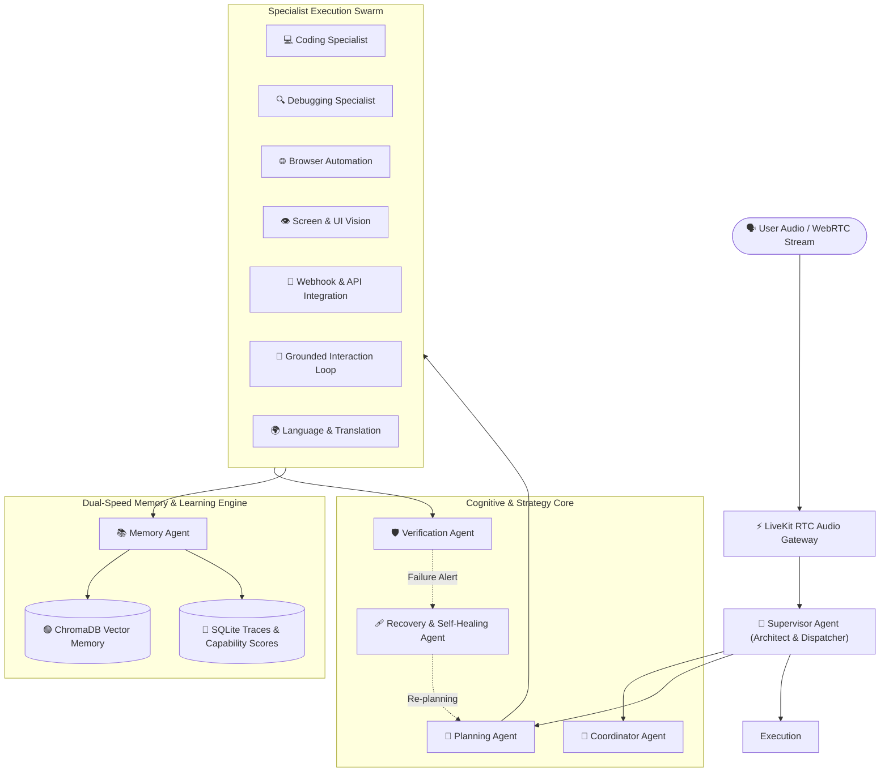

<div align="center">

# 🤖 JARVIS Voice Assistant — 14-Agent Orchestration Swarm

<p align="center">
  
  
  
  
  
  
</p>

<p align="center">
  <b>Sub-Second Real-Time Voice Assistant Powered by LiveKit WebRTC, Dual-Speed Learning Loops, and 14 Specialized Autonomous Agents</b>
</p>

</div>

---

## 🌟 Overview

**JARVIS** is an autonomous, real-time conversational voice assistant designed on a decentralized multi-agent orchestration pattern. It combines ultra-low-latency WebRTC bidirectional audio streams with a **14-agent swarm architecture** capable of high-level task planning, self-healing code execution, browser automation, visual screen understanding, and continuous reinforcement learning.

---

## 🏗️ Multi-Agent Architecture

The architecture decouples perception, orchestration, and execution into 14 distinct specialist agents coordinated by a centralized **Supervisor Agent**:



---

## 🤖 14-Agent Responsibilities Breakdown

| Agent | Core Function | Primary Tasks |
|---|---|---|
| **👑 Supervisor** | Session manager & main dispatcher | `speak`, `supervisor_routing`, `supervisor_session` |
| **🧠 Coordinator** | Failure root-cause analysis & strategy | `generate_context`, `analyze_failure`, `evaluate_plan` |
| **📐 Planning** | Multi-step deterministic & stochastic planning | `create_plan`, `replan` |
| **⚡ Execution** | Action dispatcher & environment state reader | `execute_plan`, `get_world_state` |
| **🛡️ Verification** | Constraint validation & goal satisfaction check | `verify_result` |
| **🩹 Recovery** | Self-healing fallback procedures | `recover_failure` |
| **📚 Memory** | Trajectory logging & contextual recall | `record_execution_report`, `replay`, `memory_health_check` |
| **💻 Coding** | AST refactoring & automated project synthesis | `refactor_code`, `build_project` |
| **🔍 Debugging** | Runtime error diagnosis & code patch verification | `diagnose_error`, `apply_self_healing`, `verify_fix` |
| **🌐 Browser** | Headless / live browser task execution | `automate_web_flow` |
| **👁️ Vision** | Screen capture parsing & UI coordinates detection | `analyze_screen`, `find_ui_element`, `read_screen_text` |
| **🔌 Integration** | GraphQL, REST APIs & webhook listeners | `webhook_flow`, `call_graphql`, `sync_data` |
| **🎯 Interaction** | Turn-by-turn grounded perception loops | `run_grounded_task` |
| **🌍 Language** | Multilingual translation & document parsing | `detect_language`, `translate_text`, `set_language_preference` |

---

## 🧠 Dual-Speed Learning Engine

JARVIS features a closed feedback loop that updates agent performance dynamically:
- **Fast Online Loop:** Recalculates individual agent Exponential Moving Average (EMA) capability scores immediately upon task execution and tracks failure streaks in real time.
- **Slow Consolidation Loop:** Nightly automated maintenance (`MemoryLifecycle.run_nightly` scheduled at 03:05) that recalculates ground-truth metrics, decays stale capabilities, and vectorizes execution lessons into ChromaDB.

---

## 🚀 Getting Started

### 1. Prerequisites
- Python 3.12+
- `npx` (Node Package Manager)
- API Keys: `LIVEKIT_URL`, `LIVEKIT_API_KEY`, `LIVEKIT_API_SECRET`, and `GEMINI_API_KEY` (in `.env`)

### 2. Launching the System
```bash
# Easy one-click startup (starts FastAPI backend + Frontend client):
start_jarvis.bat
```

### 3. Verification & Diagnostic Test Suite
```bash
# Specialist Reachability Smoke Test (verifies all 14 agents on the message bus):
python scripts/smoke_test.py

# End-to-End Orchestration Swarm Simulation (5 complex scenarios):
python scripts/e2e_smoke.py

# Live Capability Scores & Streak Inspector:
python check_learning_status.py
```

---

## 📁 Repository Structure

```
Jarvis/
├── apps/
│   ├── backend/                 # FastAPI / LiveKit WebRTC backend application
│   │   ├── ai/agents/           # 14 Autonomous Specialist Agents
│   │   ├── api/                 # REST endpoints and WebRTC session management
│   │   ├── modules/             # Memory lifecycle, planning engine, tools
│   │   └── tests/               # Pytest automated test suites
│   └── frontend/                # Interactive assistant web client (Vanilla JS)
├── database/                    # SQLite databases (traces.db, memory.db)
├── docs/                        # Architectural specifications
├── scripts/                     # Smoke tests and diagnostic harnesses
└── check_learning_status.py     # Monitoring CLI dashboard
```

---

## 👨‍💻 Author

**Akshaysinh Rajput**
- 🌐 Portfolio: [portfolioakshay.in](https://portfolioakshay.in)
- 💼 LinkedIn: [Akshaysinh Rajput](https://www.linkedin.com/in/akshaysinh-rajput-8a575532b/)
- 🐙 GitHub: [@ra901625072-boop](https://github.com/ra901625072-boop)